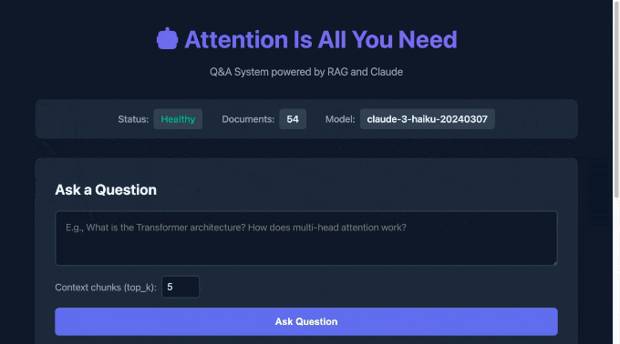

# Q&A System: "Attention Is All You Need"

A production-ready Q&A system built over the seminal "Attention Is All You Need" research paper. This system uses Retrieval-Augmented Generation (RAG) to answer questions about the Transformer architecture and related concepts.



## Features

- **Modern Web UI**: Beautiful, responsive frontend with dark theme and real-time status
- **Intelligent Q&A**: Ask questions about the Transformer architecture, attention mechanisms, and paper concepts
- **RAG Pipeline**: Uses ChromaDB for vector storage and Anthropic Claude for answer generation
- **REST API**: FastAPI-based REST API with comprehensive endpoints
- **Docker Support**: Fully containerized with Docker and docker-compose
- **Production-Ready**: Includes logging, error handling, health checks, and monitoring

## Architecture

```
┌─────────────┐     ┌──────────────┐     ┌─────────────┐
│   FastAPI   │────▶│ RAG Pipeline │────▶│   Claude    │
│     API     │     │              │     │     API     │
└─────────────┘     └──────────────┘     └─────────────┘
                           │
                           ▼
                    ┌──────────────┐
                    │  ChromaDB    │
                    │ Vector Store │
                    └──────────────┘
```

## Technology Stack

- **Web Framework**: FastAPI
- **LLM**: Anthropic Claude (claude-3-haiku-20240307)
- **Vector Database**: ChromaDB
- **Embeddings**: sentence-transformers (all-MiniLM-L6-v2)
- **PDF Processing**: pypdf
- **Containerization**: Docker

## Prerequisites

- Python 3.11+
- Docker and Docker Compose (for containerized deployment)
- Anthropic API key

## Quick Start

### Option 1: Web UI (Easiest)

1. **Set up environment variables**:
   ```bash
   cp .env.example .env
   # Edit .env and add your Anthropic API key
   ```

2. **Start the backend**:
   ```bash
   python -m venv venv
   source venv/bin/activate  # On Windows: venv\Scripts\activate
   pip install -r requirements.txt
   uvicorn app.main:app --host 0.0.0.0 --port 8000
   ```

3. **In a new terminal, serve the frontend**:
   ```bash
   cd frontend
   python -m http.server 3000
   ```

4. **Open in browser**:
   ```
   http://localhost:3000
   ```

5. **Use the UI**:
   - Click "Index Paper" to initialize the system
   - Ask questions using the web interface
   - View answers with relevant context chunks

### Option 2: Docker

1. **Set up environment variables**:
   ```bash
   cp .env.example .env
   # Edit .env and add your Anthropic API key
   ```

2. **Build and run with Docker Compose**:
   ```bash
   docker-compose up --build
   ```

3. **Initialize the system** (index the paper):
   ```bash
   curl -X POST http://localhost:8000/index
   ```

4. **Ask a question**:
   ```bash
   curl -X POST http://localhost:8000/ask \
     -H "Content-Type: application/json" \
     -d '{"question": "What is the Transformer architecture?"}'
   ```

### Option 3: API Only (Local Development)

1. **Create and activate virtual environment**:
   ```bash
   cd qa-system
   python -m venv venv
   source venv/bin/activate  # On Windows: venv\Scripts\activate
   ```

2. **Install dependencies**:
   ```bash
   pip install -r requirements.txt
   ```

3. **Set up environment variables**:
   ```bash
   cp .env.example .env
   # Edit .env and add your Anthropic API key
   ```

4. **Run the application**:
   ```bash
   uvicorn app.main:app --host 0.0.0.0 --port 8000
   ```

5. **Initialize the system**:
   ```bash
   curl -X POST http://localhost:8000/index
   ```

## Web UI

The system includes a modern web interface for easy interaction:

### Features

- **Real-time Status**: Monitor system health, document count, and model
- **One-click Indexing**: Initialize the system with a single button
- **Interactive Q&A**: Ask questions with adjustable parameters
- **Example Questions**: Pre-made questions to get started quickly
- **Context Viewing**: See relevant text chunks used for answers
- **Responsive Design**: Works on desktop, tablet, and mobile
- **Keyboard Shortcuts**: Ctrl+Enter (Cmd+Enter on Mac) to submit questions

### Accessing the UI

1. Start the backend (port 8000)
2. Serve the frontend: `cd frontend && python -m http.server 3000`
3. Open http://localhost:3000 in your browser

## API Documentation

Once the application is running, visit:
- Interactive API docs: http://localhost:8000/docs
- Alternative docs: http://localhost:8000/redoc
- Web UI: http://localhost:3000 (if frontend is running)

### Endpoints

#### `GET /`
Root endpoint with basic information.

**Response**:
```json
{
  "status": "online",
  "message": "Q&A System for 'Attention Is All You Need' paper"
}
```

#### `GET /health`
Health check endpoint.

**Response**:
```json
{
  "status": "healthy",
  "message": "Service is running"
}
```

#### `GET /status`
Get system status and configuration.

**Response**:
```json
{
  "documents_indexed": 150,
  "embedding_model": "all-MiniLM-L6-v2",
  "llm_model": "claude-3-5-sonnet-20241022",
  "vector_store_path": "./data/chroma_db"
}
```

#### `POST /index`
Download and index the "Attention Is All You Need" paper.

**Note**: This endpoint must be called once before asking questions.

**Response**:
```json
{
  "status": "success",
  "message": "Paper indexed successfully",
  "chunks_created": 150,
  "documents_indexed": 150
}
```

#### `POST /ask`
Ask a question about the paper.

**Request Body**:
```json
{
  "question": "What is the Transformer architecture?",
  "top_k": 5  // Optional: number of context chunks to retrieve
}
```

**Response**:
```json
{
  "answer": "The Transformer is a novel neural network architecture...",
  "model": "claude-3-5-sonnet-20241022",
  "context_chunks_used": 5,
  "context": [
    {
      "text": "The Transformer is a model architecture...",
      "relevance_score": 0.89
    }
  ],
  "usage": {
    "input_tokens": 1500,
    "output_tokens": 300
  }
}
```

## Example Usage

### Python

```python
import requests

# Initialize the system
response = requests.post("http://localhost:8000/index")
print(response.json())

# Ask a question
question_data = {
    "question": "How does multi-head attention work?"
}
response = requests.post(
    "http://localhost:8000/ask",
    json=question_data
)
result = response.json()
print(f"Answer: {result['answer']}")
print(f"Context chunks used: {result['context_chunks_used']}")
```

### cURL

```bash
# Check system status
curl http://localhost:8000/status

# Ask a question
curl -X POST http://localhost:8000/ask \
  -H "Content-Type: application/json" \
  -d '{
    "question": "What is the role of positional encoding in the Transformer?",
    "top_k": 3
  }'
```

## Configuration

Edit the `.env` file to customize the system:

```env
# Anthropic API Configuration
ANTHROPIC_API_KEY=your_api_key_here

# Application Configuration
APP_HOST=0.0.0.0
APP_PORT=8000
LOG_LEVEL=INFO

# RAG Configuration
CHUNK_SIZE=1000
CHUNK_OVERLAP=200
TOP_K_RESULTS=5

# Claude Configuration
CLAUDE_MODEL=claude-3-5-sonnet-20241022
MAX_TOKENS=4096
TEMPERATURE=0.7
```

## Project Structure

```
qa-system/
├── app/
│   ├── __init__.py
│   ├── config.py           # Configuration management
│   ├── embeddings.py       # Document chunking and embeddings
│   ├── main.py             # FastAPI application
│   ├── models.py           # Pydantic models
│   ├── pdf_processor.py    # PDF processing utilities
│   ├── rag_pipeline.py     # RAG implementation
│   └── vector_store.py     # ChromaDB integration
├── frontend/               # Web UI
│   ├── index.html         # Main HTML structure
│   ├── styles.css         # Styling and responsive design
│   └── script.js          # API interactions and UI logic
├── data/                   # Data directory (auto-created)
│   └── chroma_db/         # Vector database storage
├── tests/                  # Test directory
├── .env                    # Environment variables (create from .env.example)
├── .env.example           # Example environment variables
├── .gitignore
├── Dockerfile
├── docker-compose.yml
├── requirements.txt
├── demo.gif               # Demo animation
└── README.md
```

## Development

### Running Tests

```bash
pytest tests/
```

### Linting

```bash
flake8 app/
black app/
```

### Type Checking

```bash
mypy app/
```

## Troubleshooting

### Vector store is empty error
If you get "Vector store is empty" error, make sure to call the `/index` endpoint first:
```bash
curl -X POST http://localhost:8000/index
```

### API key errors
Ensure your `.env` file contains a valid Anthropic API key:
```env
ANTHROPIC_API_KEY=sk-ant-...
```

### Docker container not starting
Check the logs:
```bash
docker-compose logs -f
```

### Port already in use
Change the port in `.env` or `docker-compose.yml`:
```env
APP_PORT=8001
```

## Performance Considerations

- **First-time indexing**: Takes 30-60 seconds to download, process, and index the paper
- **Query response time**: Typically 2-5 seconds depending on question complexity
- **Memory usage**: ~500MB-1GB depending on model and data
- **Disk usage**: ~100MB for vector database and models

## Security Notes

- Never commit your `.env` file with real API keys
- Use environment variables for sensitive configuration
- Consider rate limiting in production
- Implement authentication for production deployments

## License

This project is provided as-is for educational and research purposes.

## Acknowledgments

- Paper: "Attention Is All You Need" by Vaswani et al. (2017)
- Built with FastAPI, ChromaDB, and Anthropic Claude

## Support

For issues and questions, please open an issue in the repository.
